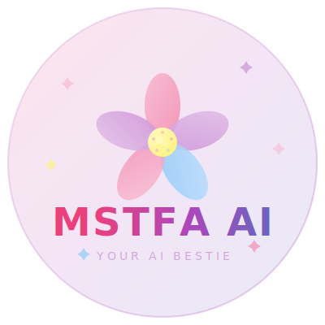

<div align="center">



# MSTFA AI

### your cute anime-style AI bestie who actually gets you

<br/>


<br/>


<br/>

[Preview Here](https://mstfa-ai.vercel.app/)

</div>

---

## what even is this?

basically MSTFA AI is a vibes-only chat app where you talk to an AI that actually has personality. no boring robotic responses here — she's giving cute anime energy 24/7 ✨

built with **Next.js 14**, **Supabase**, and **Groq** — deployed on **Vercel** so it's fast af 🔥

## features go crazy

- 🌸 **anime aesthetic** — pastel colors, sparkles, the whole aesthetic package
- 💬 **persistent chats** — your conversations don't disappear (we're not like other AIs)
- 🔒 **auth system** — sign up / login with email via Supabase
- 📱 **mobile friendly** — works on your phone so you can chat from bed
- ✨ **sparkles everywhere** — because why not
- 🎨 **glass morphism UI** — the design is giving ✨main character energy✨

## tech stack (the dream team)

| tech | what it does |
|------|-------------|
| **Next.js 14** | the framework carrying everything on its back |
| **TypeScript** | types so we don't crash and cry |
| **Tailwind CSS** | making things pretty without the struggle |
| **Supabase** | database + auth (the real MVP) |
| **Groq** |
| **Vercel** | hosting so it's always up |

## getting started (for the devs)

### prerequisites

- **Node.js** 18+ (don't be using outdated stuff pls)
- **npm** or **yarn** or **pnpm** (no judgment)
- **Supabase** account

### setup

```bash
# clone the thing
git clone https://github.com/KhizarDoingProgramming/MSTFA-AI.git

# get in there
cd MSTFA-AI

# install the dependencies
npm install

# copy the env file
cp .env.example .env.local

# fill in your keys in .env.local
```

### environment variables

```env
NEXT_PUBLIC_SUPABASE_URL=https://your-project.supabase.co
NEXT_PUBLIC_SUPABASE_ANON_KEY=your-anon-key
SUPABASE_SERVICE_ROLE_KEY=your-service-role-key
NEXT_PUBLIC_APP_URL=http://localhost:3000
```

### run it locally

```bash
npm run dev
```

then open [http://localhost:3000](http://localhost:3000) and vibe ✨

## database schema

we use Supabase with Row Level Security so nobody's reading your chats but you (and MSTFA AI obviously)

- **chats** — stores all your conversations
- **messages** — every single message ever sent
- **RLS policies** — keeping things secure and private 🔐

check `supabase/schema.sql` if you wanna see the full schema thing

## project structure

```
mstfa-ai/
├── src/
│   ├── app/              # pages & routes
│   │   ├── chat/         # the main chat page (where the magic happens)
│   │   ├── login/        # login page
│   │   ├── signup/       # signup page
│   │   └── api/chat/     # the AI endpoint
│   ├── components/       # UI components (the building blocks)
│   │   ├── auth/         # auth form
│   │   ├── chat/         # chat UI stuff
│   │   └── ui/           # sparkles, avatars, typing indicators
│   ├── lib/              # utilities & supabase setup
│   └── types/            # TypeScript types (we type safe here)
├── supabase/
│   └── schema.sql        # the database blueprint
└── package.json
```


## contributing

wanna help make MSTFA AI even more fire? PRs are welcome!! just don't break anything plssss 

## license

idk yet but vibes are free 

---

<div align="center">

**made with 💖 and way too much ☕**

_By Mustafa_

</div>
